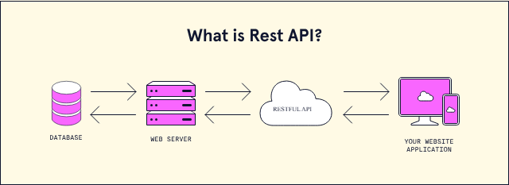

### NODE JS

## The “back end”, meanwhile, denotes all that goes on “behind the scenes”
*  If you’re running your own server, you have a ton of flexibility but plenty of headaches. If you’re using the cloud (which we will be doing later), you may be restricted to those languages that your cloud provider has installed on their platform… It doesn’t do you much good if the servers you’re “borrowing” from can’t understand your code!

* most popular server-side languages are PHP, C#, Ruby, Python and Java (not to be confused with JavaScript)

*  back-end can be built in many different programming languages, from compiled languages like Java to interpreted languages like PHP, Python and Ruby.

* Back-end developers also need to interact with database management systems like PostgreSQL, SQL Server, or MySQL. This usually requires knowledge of Structured Query Language (SQL) to read, write, modify, and delete data

* Back-end frameworks like **Flask** or **Django**

* A few popular web technology stacks include:

    * MEAN: MongoDB, Express, Angular, and Node
    * LAMP: Linux, Apache, MySQL, and PHP/Python
    * JAMstack: JavaScript, APIs, and Markup  

## **HTTP**
## What is HTTP?

* HTTP (Hypertext Transfer Protocol) is used to structure requests and responses over the internet. HTTP requires data to be transferred from one point to another over the network. The transfer of resources happens using TCP (Transmission Control Protocol). In viewing this webpage, TCP manages the channels between your browser and the server 

## What is an HTTP request?

* HTTP request acts like a conversation starter between a client and server: the client asks for something, and the server replies with either the requested resource or an explanation of why it cannot be provided.

### Every HTTP request follows a standard format, which generally includes:

1. Request line: Specifies the HTTP method (e.g., GET, POST), the resource path (e.g., /index.html), and the protocol version (e.g., HTTP/1.1).

* Example: GET /index.html HTTP/1.1

2. Headers: Provide additional context or metadata about the request. Common headers include:

* Host: Indicates the domain name of the server.
* User-Agent: Identifies the client (e.g., Chrome, Firefox).
* Accept: Informs the server what type of content the client can handle (e.g., HTML, JSON).
* Authorization: Sends authentication credentials when accessing protected resources.

3. Body (Optional): Includes data sent to the server, typically in POST, PUT, or PATCH requests. For example, when submitting a login form, the username and password are sent in the body.

* Upon receiving the HTTP request, the server processes it according to the provided instructions. If successful, it responds with an HTTP response that contains:

    * A status code (e.g., 200 OK, 404 Not Found, 500 Internal Server Error)
    * Response headers with metadata
    * An optional response body (such as a webpage, JSON data, or an image)

## Types of HTTP requests

* GET: Retrieves data from the server (e.g., loading a webpage).
* POST: Sends data to the server.
* PUT: Updates existing data on the server.
* DELETE: Removes specified data from the server.
* HEAD: Retrieves only headers of a resource, without the actual content.
* PATCH: Applies partial modifications to a resource.
* OPTIONS: Describes communication options available for a resource.

## How HTTP requests work

* When you type an address such as www.codecademy.com into your browser, you are commanding it to open a TCP channel to the server that responds to that URL. A URL is like your home address or phone number because it describes how to reach you.

* In this situation, our computer, which is making the request, is called the client. The URL you are requesting is the address which belongs to the server.

* Once the TCP connection gets established, the client sends an HTTP GET request to the server to retrieve the webpage it should display. After the server has sent the response, it closes the TCP connection. If you open the website in your browser again or if your browser automatically requests something from the server, a new connection is opened, which follows the same process described earlier

## Note
* DNS (Domain Name Server) 
* IP (Internet Protocol) 

***

* The GET request contains the following text:

    * GET / HTTP/1.1 
    * Host: www.codecademy.com 

***

* If the server is able to locate the path requested, the server might respond with the header:

    * HTTP/1.1 200 OK 
    * Content-Type: text/html 

## HTTP requests vs HTTPS requests

* HTTP requests are suitable only for basic, non-sensitive communication, while HTTPS requests are the secure, trusted standard for modern web interactions.

## **REST**

## What is REST?
* REST (Representational State Transfer) is a well-known architectural style used for providing standards between computer systems on the web, making it easier for systems to communicate with each other. Its main goal is to simplify interactions between clients and servers by providing a consistent, resource-based approach to accessing and manipulating data

* REST-compliant systems, often called RESTful systems, are defined by two key principles: client-server architecture and statelessness

## Client-server architecture
* In the REST architectural style, the implementation of the client and the server can be done independently without each knowing about the other. This means that the code on the client side can be changed at any time without affecting the operation of the server, and the code on the server side can be changed without affecting the operation of the client.

* As long as each side knows what format of messages to send to the other, they can be kept modular and separate. Separating the user interface concerns from the data storage concerns, we improve the flexibility of the interface across platforms and improve scalability by simplifying the server components. Additionally, the separation provides each component with the ability to evolve independently.

* soo..By using a REST interface, different clients hit the same REST endpoints, perform the same actions, and receive the same responses.

## Statelessness
* Systems that follow the REST paradigm are stateless, meaning that the server does not need to know anything about what state the client is in and vice versa. In this way, both the server and the client can understand any message received, even without seeing previous messages. This constraint of statelessness is enforced through the use of resources, rather than commands. Resources are the nouns of the Web - they describe any object, document, or thing that you may need to store or send to other services.

* These constraints help RESTful applications achieve reliability, performance, and scalability by ensuring that components can be managed, updated, and reused without disrupting the overall system, even during operation

## What is a REST API?
* A REST API (Application Programming Interface), also known as a RESTful API, is a way for applications to interact with each other over the web following REST principles. It provides a structured method for accessing and manipulating resources—such as users, products, or documents—using standardized HTTP methods (GET, POST, PUT, and DELETE).

* In a REST API, each resource is identified by a unique URI (Uniform Resource Identifier), and data is typically exchanged in lightweight formats such as JSON or XML. The API acts as a contract between the client and the server, ensuring that requests are well-formed and responses are predictable. This consistency allows developers to integrate systems more easily, scale applications, and maintain a clear separation between frontend clients and backend services.

* Here is a visual representation of how the REST API works:

## Client-server communication in REST
* In the REST architecture, clients send requests to retrieve or modify resources, and servers send responses to these requests

### **Making requests**

* REST requires that a client make a request to the server in order to retrieve or modify data on the server. A request generally consists of:

    * An HTTP verb, which defines what kind of operation to perform
    * A header, which allows the client to pass along information about the request
    * A path to a resource
    * An optional message body containing data

### HTTP verbs

* There are four basic HTTP verbs we use in requests to interact with resources in a REST system:

    * GET: Retrieves a specific resource (by ID) or a collection of resources
    * POST: Creates a new resource
    * PUT: Updates a specific resource (by ID)
    * DELETE: Removes a specific resource (by ID)

### **Headers and Accept parameters**
* In the header of the request, the client sends the type of content that it is able to receive from the server. This is called the Accept field, and it ensures that the server does not send data that cannot be understood or processed by the client. The options for types of content are MIME Types (or Multipurpose Internet Mail Extensions). They are used to specify the content types in the Accept field, including a type and a subtype. They are separated by a slash (/)

* For example, a client accessing a resource with an id of 23 in an articles resource on a server might send a GET request like this:

    * * GET /articles/23 
      * Accept: text/html, application/xhtml 
* The Accept header field, in this case says that the client will accept the content in text/html or application/xhtml.

### **Paths**
* Requests must contain a path to a resource that the operation should be performed on. In RESTful APIs, paths should be designed to help the client know what is going on

* For example:

    * GET fashionboutique.com/customers/:id: Retrieves the item in the customers resource with the id specified.
    * DELETE fashionboutique.com/customers/:id: Deletes the item in the customers resource with the id specified.

### **Sending responses**
* When a client makes a request to a RESTful API, the server must send back a response that clearly communicates both the outcome of the request and the format of any data returned. Responses typically include headers, which provide metadata such as content type and status codes, and may also include a body, which contains the requested resource data. Understanding how servers send responses is crucial for building reliable client-server interactions

### **Content types**
* For example, when a client is accessing a resource with id 23 in an articles resource with this GET Request:

    * GET /articles/23 HTTP/1.1 
    *  Accept: text/html, application/xhtml 
* The server might send back the content with the response header:

    * HTTP/1.1 200 (OK) 
    * Content-Type: text/html 
* This would signify that the content requested is being returned in the response body with a content-type of text/html, which the client said it would be able to accept

### **Response codes**

* Responses from the server contain status codes to alert the client to information about the success of the operation
* Status code and there	Meaning
    * 200 (OK)	This is the standard response for successful HTTP requests.
    * 201 (CREATED)	This is the standard response for an HTTP request that resulted in an item being successfully created.
    * 204 (NO CONTENT)	This is the standard response for successful HTTP requests, where nothing is being returned in the response body.
    * 400 (BAD REQUEST)	The request cannot be processed because of bad request syntax, excessive size, or another client error.
    * 403 (FORBIDDEN)	The client does not have permission to access this resource.
    * 404 (NOT FOUND)	The resource could not be found at this time. It is possible it was deleted, or does not exist yet.
    * 500 (INTERNAL SERVER ERROR)	The generic answer for an unexpected failure if there is no more specific information available.

