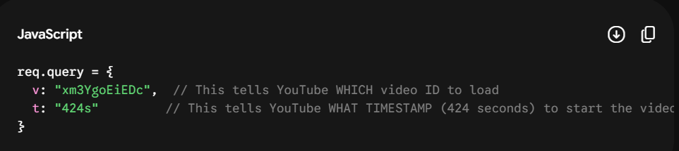

# Express.js {FrameWork}

## User Interface Frameworks
* Bootstrap
    * Very well known and built by Twitter
    * Easy to learn and looks professional
    * Can be easy to spot "Bootstrap Sites"
    * Can be difficult to customize components
* Materialize
    * Clean looking
    * A bit more "fun" than Bootstrap
    * Lots of styling and color options
    * Follows Google's Material style guide
* Foundation
    * Lots of examples
    * Professional looking
* Semantic UI
    * Lots built-in
    * Built-in themes so it's customizable
* Grommet
    * Has a huge focus on accessibility
    * Looks really clean
    * Not as used as some of the others
    * Made for React JS (another framework we will look at later)


## Frontend Frameworks
* Frontend frameworks are, in most cases, written in JavaScript and are for organizing the functionality, interactivity of your website. Some of these include:

* Vue
    * Easy to learn
    * Very fast
    * All tools associated with it are packaged well
    * Takes parts from Angular and React and optimizes them
    * less widely adopted than some others
    * Flexible -- you can use it in multiple ways
* AngularJS
    * Built by Google
    * Well supported
    * Huge number of features
    * Improves application scalability
    * Difficult to debug
    * Large learning curve
* Angular 2+
    * Built by Google
    * Well supported
    * Encourages reusability
    * Improves application scalability
    * Large learning curve
* React
    * Built by Facebook
    * Bundles frontend code into components
    * Organizes code and data to make code more reusable
    * Large learning curve
* Ember
    * Gives a large amount of functionality out of the box
    * Opinionated (you have to use its formatting)
    * Steep learning curve

## Backend Frameworks
* Backend frameworks are a lot more varied. They are written in a variety of programming languages and have a wide variety of features. Below, like the above list, is a very incomplete list of some of the frameworks out there for writing application backends.

* Spring MVC
    * Java (more difficult language to learn)
    * Very fast
    * Less opinionated
* Django
    * Python (easier language to learn)
    * Happy medium between being very opinionated and less structured
    * Gives you a lot of functionality out of the box (like user authentication, database connections, and view rendering)
    * Can be difficult to integrate a fancy front-end.
    * Python's data handling is amazing
* Flask
    * Python (easier language to learn)
    * Less opinionated and more customizable than Django
    * Gives you less out of the box (you have to build more)
* Ruby on Rails
    * Ruby (easier language to learn)
    * Very opinionated
    * Has great tools like scaffolding so you can build things fast
    * Gives you a lot of functionality out of the box (like user authentication, database connections, and view rendering)
    * The asset pipeline helps with front-end development
    * Ruby takes longer to run programs than some other programming languages
* Meteor
    * JavaScript (easier language to learn)
    * Gives you a lot of functionality out of the box (like user authentication, database connections, and view rendering)
    * Integrates very well with modern front-ends
* Express
    * JavaScript (easier language to learn)
    * Very customizable
    * Very lightweight
    * Less built-in features
    * Node is very fast


## Routes

* Routes essentially just match a request’s HTTP verb (e.g. GET or POST) and URL path to the appropriate set of middleware functions - the controllers

```jsx

app.get("/", (req, res) => res.send("Hello, world!"));

```
* app.get "/" ... tells us that this route will match any GET requests that go through the app router (which is our whole server!) to the / path. If instead we had the following:

 ```jsx
 app.post("/messages", (req, res) => res.send("This is where you can see any messages."));

```
* That would tell us the route matches any POST requests to the /messages path of our app. If you sent a GET request to the /messages path, it would not match this route
* Each HTTP verb has its own Express route method, and you can also use app.all() to make a route match all verbs

## Paths

### Route parameters

```jsx
app.get("/:username/messages", (req, res) => {
  console.log(req.params);
  res.end();
});
```
* So : is used when that part of the URL can change. If the path is always fixed, then no need for :
* here we can get diff user namess..

```jsx
app.get("/:username/messages/:messageId", (req, res) => {
  console.log(req.params);
  res.end();
});
```
* here we can get digg username and message ID

    ```jsx
    Example :

      Imagine you are building a social media site. You can't hardcode a separate URL path for every single user on Earth (e.g., /odin/messages, /thor/messages, etc.).

    Instead, you use Route Parameters to create a placeholder or a wildcard in your URL structure.

    How you write it in code: You use a colon (:) followed by a variable name.

    "/:username/messages"

    How Express reads it: When a user visits a URL, Express takes whatever is written in place of :username and stores it inside an object called req.params
    ```

### Query parameters

* A **?** denotes the **start** of the query parameters and each query **separated** by an **&**

* While route parameters define the structure of the path, Query Parameters are used to sort, filter, or pass extra optional arguments to that path. They always appear at the very end of a URL

```jsx
Example:

If a user goes to /odin/messages?sort=date&direction=ascending:

Express still routes them to the /:username/messages path.

But it extracts the extra details and creates this object:
req.query = { sort: "date", direction: "ascending" }

Note: If someone repeats a key (like ?sort=date&sort=likes), Express is smart enough to group them into an array: { sort: ["date", "likes"] }
```

### The Real-World YouTube Example
* The text uses YouTube to show you how you already use this every day:

    * When you watch a video, the URL looks like this: https://www.youtube.com/watch?v=xm3YgoEiEDc&t=424s

        Behind the scenes, YouTube’s servers receive this request. Because of the ?, they parse the query parameters into an object like this:

       

## Diff
* **Route Parameters** (req.params): Built into the URL path itself (/users/:id). Used to determine what resource you are looking at.

* **Query Parameters** (req.query): Appended to the end of the URL (?search=shoes&size=10). Used to filter, sort, or modify how that resource is displayed.


## Controllers

* The controller’s job is really to act as the ultimate middleman. It knows which questions it wants to ask the model, but lets the model do all the heavy lifting for actually solving those questions

### Handling responses

* When it comes to sending responses from our controllers, we have several methods at our disposal. Let’s explore some of the commonly used methods and their use cases.

    * **res.send** - A general-purpose method for sending a response
    * **res.json** - This is a more explicit way to respond to a request with JSON
    * **res.redirect** - When we want to redirect the client to a different URL, this method allows for that capability
    * **res.render** - res.render lets you render a view template and send the resulting HTML as the response
    * **res.status** - This sets the response’s status code but does not end the request-response cycle by itself. We can chain other methods through this (e.g. res.status(404).send(...) but note that we can’t do res.send(...).status(404)). We can omit this if we wish to use the default status code of 200

### Middleware
* Middleware functions are a core concept in Express and play a crucial role in handling requests and responses. They operate between the incoming request and the final intended route handler

* A middleware function typically takes three arguments (however, there is one that we will get into later that has four):

    * **req** - The request object, representing the incoming HTTP request.
    * **res** - The response object, representing the HTTP response that will be sent back to the client.
    * **next** - The function that passes control to the next middleware function in the chain 


## Diff btw Route and Controllers

### **Routes**: The Traffic Cop
* The route's only job is to listen for a request and forward it to the right place. It maps an HTTP method (GET, POST, PUT, DELETE) and a URL path to a specific function.

* Responsibility: URL matching and routing.

* What it cares about: “Is the user trying to GET /api/books or POST to /api/books?”

* Code Example:

    ```jsx
    // routes/bookRoutes.js
    const express = require('express');
    const router = express.Router();
    const { getAllBooks } = require('../controllers/bookController');

    // Just matching the path to the controller function
    router.get('/books', getAllBooks); 

    module.exports = router;

    ```

## **Controllers**: The Brains

* The controller contains the actual business logic. It takes the request, talks to the database (via your models), processes data, and sends back the final response (like JSON or an error message).

* Responsibility: Processing data and deciding what to send back.

* What it cares about: “Let me fetch the books from MongoDB, format them, and send a 200 OK status.”

* Code Example:

    ```jsx

    const Book = require('../models/bookModel');

    // The actual logic lives here
    const getAllBooks = async (req, res) => {
        try {
            const books = await Book.find({});
            res.status(200).json(books);
        } catch (error) {
            res.status(500).json({ message: "Server Error" });
        }
    };

    module.exports = { getAllBooks };
    ```

### Middleware
* Middleware functions are the backbone of Express. They are functions that run sequentially after a request is received, but before the final response is sent

    ```jsx
    function myMiddleware(req, res, next) {
    // 1. Do something (log data, check auth, change req/res objects)
    req.customProperty = "Hello!";
    
    // 2. Pass control to the next middleware in line
    next(); 
    }
    ```

* Types of Middleware:

    * Application-level: Bound to the entire app using app.use(). Runs on every single request.

    * Router-level: Bound only to specific routes (e.g., authorRouter.use())

### The next() Function Exploded
* The text notes four ways to use next(), though you will mostly use the first two:
```
1. next() — Moves seamlessly to the next middleware function in line.

2. next(err) — Skips all regular middleware and jumps straight to the Error Handling Middleware.

3. next('route') — Skips remaining middleware in the current route block but keeps processing matching paths.

4. next('router') — Skips everything inside a specific router file and jumps back to the parent app.js file

```

### Error Handling in Express
* If an error happens during an asynchronous database operation, your application might crash. Express handles this using two main patterns.

1. Pattern A: The Try/Catch Block
You wrap your controller logic in a standard JavaScript try/catch block. If something fails, you catch it manually

    ```jsx

    try {
    const author = await db.getAuthorById(authorId);
    res.send(author.name);
    } catch (error) {
    res.status(500).send("Internal Server Error");
    }

    ```

2. Pattern B: Error-Handling Middleware (The Global Catch)
Instead of writing try/catch in 50 different controllers, Express can catch errors globally. An Error Handler is a special middleware that must have exactly 4 arguments: (err, req, res, next)

    ```jsx

    // This goes at the VERY BOTTOM of your app.js file
    app.use((err, req, res, next) => {
    console.error(err);
    res.status(500).send("Something went wrong globally!");
    });

    ```

* Whenever an error is thrown inside an async function, Express automatically catches it and forwards it directly to this 4-argument function

### Creating Custom Errors
* The problem with a global error handler is that it usually sends a generic 500 Internal Server Error. What if an author wasn't found and you wanted to send a 404 Not Found?

* You can create a custom JavaScript Class that inherits from the built-in Error object but adds a custom statusCode:

```jsx
// 1. Define the Custom Error
class CustomNotFoundError extends Error {
  constructor(message) {
    super(message);
    this.statusCode = 404; // Custom property
    this.name = "NotFoundError";
  }
}

// 2. Throw it in your Controller
if (!author) {
  throw new CustomNotFoundError("Author not found"); 
  // Express catches this and sends it to the global error handler
}

// 3. Handle it dynamically in your Global Error Handler
app.use((err, req, res, next) => {
  // Uses the custom status code (404) if it exists, otherwise defaults to 500
  res.status(err.statusCode || 500).send(err.message); 
});

```
